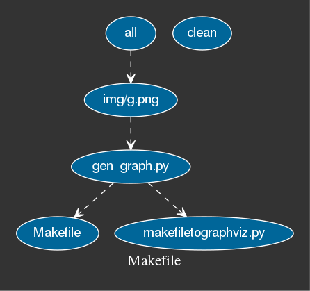

# click on the pictures!

<a href="basic_graph">
  </img>
</a>

<a href="makefile_graph">
  </img>
</a>

## dependencies
- www.graphviz.org
  - sudo python3.5 -m pip install -U graphviz

:poop: :+1: :100: :eyes: :joy_cat:
